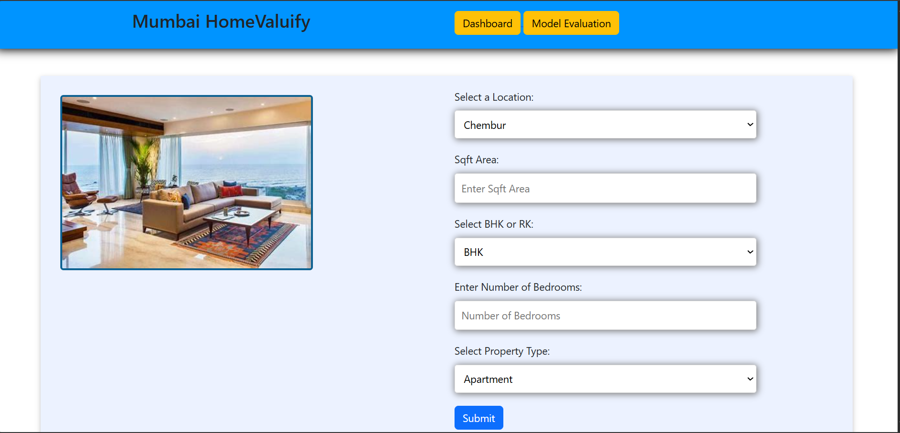
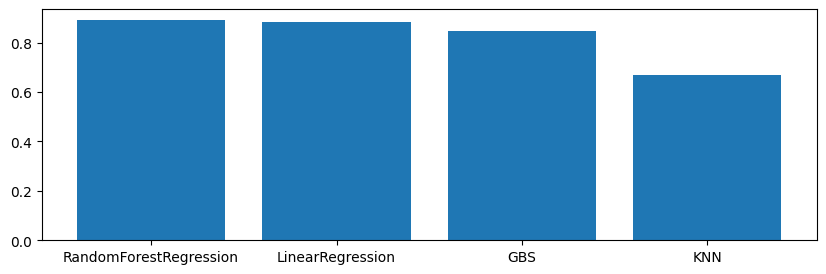
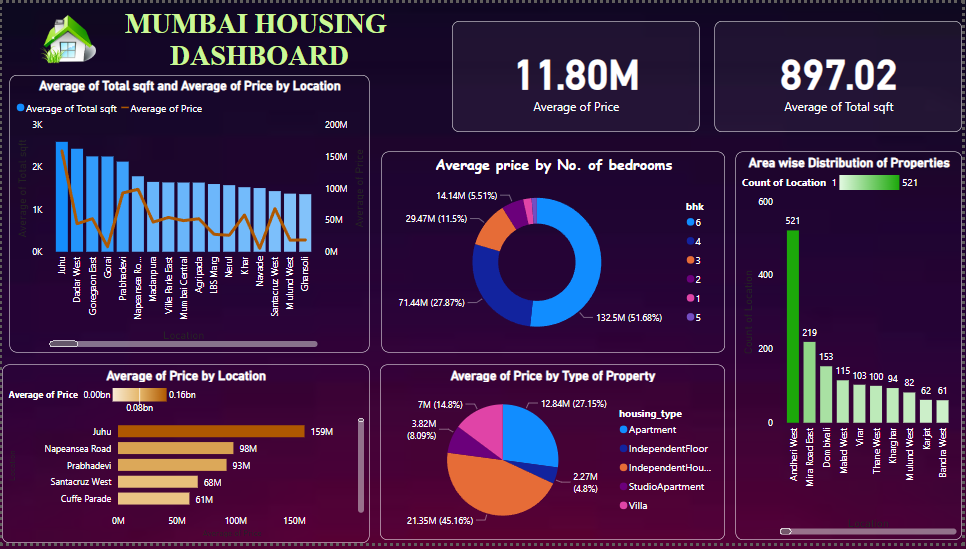

# Mumbai Home Valuefy

**Mumbai Home Valuefy** is a machine learning-based web application that predicts the price of apartments in Mumbai. It takes into account various features such as area, number of bedrooms, bathrooms, apartment type, and location. The app provides a simple user interface to predict apartment prices, and also integrates a live Power BI dashboard for real-time analytics and insights.


# Overview 

**Mumbai Home Valuefy** is a machine learning-based web application designed to predict the price of apartments in Mumbai. The project leverages a **Random Forest Regressor**, a robust ensemble machine learning algorithm, to accurately estimate apartment prices based on features such as:

- **Area**: Size of the apartment in square feet.
- **Bedrooms and Bathrooms**: Number of bedrooms and bathrooms in the apartment.
- **Apartment Type**: Categorization of the apartment (e.g., 2BHK, 3BHK).
- **Location**: Geographical area within Mumbai.

The application provides users with a seamless interface for inputting their parameters and receiving predictions. Additionally, the project incorporates a live **Power BI Dashboard** for real-time analytics, offering valuable insights into the Mumbai real estate market.

### Why Random Forest Regressor?
The **Random Forest Regressor** was chosen for its ability to handle large datasets with high dimensionality and its robustness against overfitting. It aggregates predictions from multiple decision trees, ensuring accuracy and generalization in price predictions.



### Features 
- **Apartment Price Prediction**: Predicts the price of an apartment based on user inputs like area, number of bedrooms, bathrooms, apartment type, and location.
- **Power BI Dashboard**: Access to a live dashboard with real-time data and analytics about the Mumbai real estate market.
- **User Interface**: Built with HTML, CSS, and Bootstrap for a clean and responsive design.
- **Backend**: The machine learning model is deployed using Flask, making the app easy to use and scalable.

### Technologies Used
- **Machine Learning**: Model trained using Scikit-learn or any other machine learning library.
- **Backend**: Flask framework for handling HTTP requests and serving the model.
- **Frontend**: HTML, CSS, Bootstrap for the user interface.
- **Analytics**: Power BI for creating and hosting the real-time analytics dashboard.
- **Cloud Hosting**: Microsoft Azure for hosting the Power BI dashboard.

## Installation

To run **Mumbai Home Valuefy** on your local machine, follow the instructions below:

### Prerequisites
- Python 3.8+ installed on your machine.
- pip (Python package installer).

### Steps to Set Up Locally:

1. **Clone the Repository**:
   Start by cloning the repository to your local machine:
   ```bash
   git clone https://github.com/adityadesity/MumbaiHomeValuefy.git
   ```

2. **Create a Virtual Environment**:
   If you are using Anaconda, run the following command:
   ```bash
   conda create -n venv
   ```

3. **Activate venv**:
   ```bash
   conda activate venv
   ```

4. **Install the Required Packages**:
   ```bash
   pip install -r requirements.txt
   ```

5. **Run the Application**:
   ```bash
   python server.py
   ```

The app will be running on [localhost:5000](http://localhost:5000)

## Dataset
Link to dataset: [Mumbai House Prices](https://www.kaggle.com/datasets/dravidvaishnav/mumbai-house-prices)

## Dashboard
